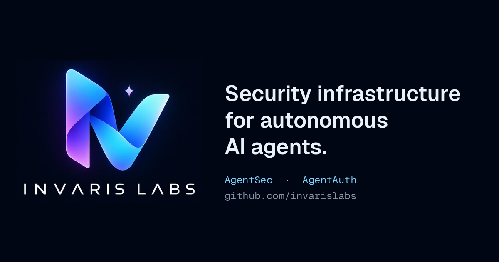

<p align="center">
  
</p>

# Invaris Labs website

Source for the [Invaris Labs](https://github.com/invarislabs) website. Invaris Labs builds open-source security infrastructure for autonomous AI agents.

The site is one statically exported page that presents both projects:

| Project | What it does | Repository |
|---|---|---|
| **AgentSec** | Adversarial security and reliability testing for AI agents | [invarislabs/invaris-agentsec](https://github.com/invarislabs/invaris-agentsec) |
| **AgentAuth** | Cryptographic identity and delegated authorization for agents | [invarislabs/agent-auth](https://github.com/invarislabs/agent-auth) |

## Quick start

Requires Node.js 20.9 or later.

```bash
npm install
npm run dev          # http://localhost:3000
```

Build and preview the production site:

```bash
npm run build        # writes the static site to out/
npm start            # serves out/ locally
```

## Scripts

| Script | What it does |
|---|---|
| `npm run dev` | Development server with hot reload |
| `npm run build` | Static export to `out/` |
| `npm start` | Serve the built `out/` folder locally |
| `npm run lint` | ESLint (Next.js core-web-vitals and TypeScript rules) |
| `npm run typecheck` | TypeScript check (`tsc --noEmit`) |

Before opening a pull request, run `npm run lint && npm run typecheck && npm run build`.

## Deploying

`next.config.ts` sets `output: "export"`, so `npm run build` produces plain HTML, CSS and JS in `out/`. That folder can be served by any static host (GitHub Pages, Cloudflare Pages, Netlify, Vercel, S3).

- Set `NEXT_PUBLIC_SITE_URL` at build time (see below) so social previews and the sitemap use the real domain.
- If the site is served from a subpath, for example `https://invarislabs.github.io/invaris-labs-website/`, also set `basePath` in `next.config.ts`. With a custom domain it isn't needed.
- Image optimisation is turned off (`images.unoptimized`) because a static export has no server to run it. The images are already small and pre-sized.

## Configuration

| Variable | Purpose |
|---|---|
| `NEXT_PUBLIC_SITE_URL` | Public origin, e.g. `https://example.com`. Used for absolute OpenGraph URLs, the canonical tag, `robots.txt` and `sitemap.xml`. On Vercel, `VERCEL_PROJECT_PRODUCTION_URL` is used automatically if this is unset. The canonical tag is left out until one of them is set. |

## Editing content

Most changes don't touch layout code:

| To change | Edit |
|---|---|
| Links (GitHub, socials, docs, contact) | `src/lib/site.ts` |
| AgentSec commands, terminal output, policy, check categories | `src/content/agentsec.ts` |
| AgentAuth flow, limits, comparison table, code snippets | `src/content/agentauth.ts` |
| Articles in the Writing section | the `articles` array in `src/components/sections/writing.tsx` |
| Page title, description, social card text | `src/app/layout.tsx` and `public/og.png` |
| Colours, fonts, motion | the `@theme` block in `src/app/globals.css` |

**Adding an article:** add an object (`kind`, `title`, `description`, `topics`, `href`) to `articles` in `writing.tsx`. The grid adjusts itself.

**Accuracy:** product claims, commands and snippets on the site are taken from the AgentSec and AgentAuth READMEs. Check new copy against those READMEs so the site never describes a feature that isn't built.

## Project structure

```
src/
  app/
    layout.tsx          metadata, OpenGraph, JSON-LD, fonts
    page.tsx            assembles the sections in order
    globals.css         design tokens and base styles
    robots.ts           robots.txt
    sitemap.ts          sitemap.xml
    icon.png            favicon and app icons
  components/
    layout/             header (with mobile menu) and footer
    sections/           one file per section: hero, products, agentsec,
                        agentauth, stack, writing, about, founder, open-source
    ui/                 buttons, code blocks and tabs, icons, client helpers
  content/              AgentSec and AgentAuth copy and snippets
  lib/
    site.ts             site constants and every outbound link
    highlight.tsx       small server-side syntax highlighter
public/
  brand/                Invaris Labs logo (original) and mark crop
  og.png                1200×630 social card
```

## Tech

- **Next.js 16** (App Router), statically exported
- **TypeScript** and **Tailwind CSS v4**
- **Geist Sans / Geist Mono** from the `geist` package, self-hosted with no requests to Google
- **No UI or animation libraries.** Motion is CSS plus a few small client components, and all of it is turned off under `prefers-reduced-motion`. Code highlighting runs at build time, so it ships no JavaScript.

## Accessibility

The page uses semantic landmarks, a skip link, visible focus states, keyboard-operable tabs and menu, and text alternatives for diagrams. Before merging visual changes, check keyboard navigation and run an accessibility audit (for example Lighthouse or axe).

## Related

- [AgentSec](https://github.com/invarislabs/invaris-agentsec)
- [AgentAuth](https://github.com/invarislabs/agent-auth)
- [Writing by Arunima Chaudhuri](https://arunima-chaudhuri.hashnode.dev)
